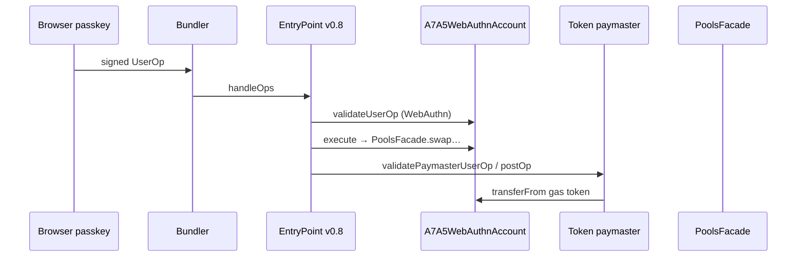

# How it works

## User flow

1. User creates a **passkey** (P-256) in the browser; public key `(qx, qy)` is stored locally.
2. **Counterfactual address** is derived via `A7A5AccountFactory.predictAddress(initializeWebAuthn(qx,qy))`.
3. First UserOp includes **initCode** = factory address + `cloneAndInitialize` calldata; EntryPoint deploys the clone and runs initialization.
4. Swap calldata is wrapped in **ERC-7821** `execute(batchMode, executionData)` on the smart account.
5. User signs the EntryPoint **userOpHash** with WebAuthn; bundler submits `handleOps`.
6. **Token paymaster** sponsors ETH gas and pulls A7A5 or USDT from the account after the op (with oracle-priced conversion).

## Gas payment model

- No third-party “gas manager” — only **ERC-20 paymasters** (`A7A5Paymaster`, `UsdtPaymaster`).
- Account must **approve** the paymaster for the chosen gas token before the UserOp.
- A7A5 paymaster grosses up for fee-on-transfer; USDT paymaster uses standard ERC-20 transfers.

## Security notes

- Only EntryPoint may call `validateUserOp` / `execute` paths on the account.
- Oracles enforce Chainlink staleness windows consistent with existing A7A5 oracle tests.
- Paymasters are pausable and owner-controlled for oracle rotation and EntryPoint deposit withdrawal.

## Architecture (high level)

